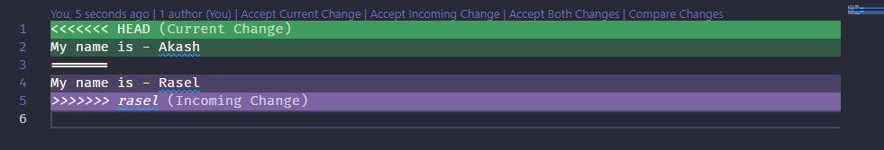

# All About Git🔥

## 📚Table of Content

- [Some Terminology](#🧠some-terminology)
- [Important Commands](#🍦important-commands)
- [Branching](#🌲branching)
- [Merge](#🧃merge)
- [Stash](#⛅stash)

## 🧠Some Terminology

**`Working Directory:`** আমরা আমাদের পিসি বা ল্যাপটপের যে ডিরেক্টরিতে কাজ করি সেটা হলো আমাদের ওয়ার্কিং ডিরেক্টরি ।

**`Local Repository:`** আমরা যখন গিটে কাজ করি তখন গিট আমাদের জন্য locally একটা codebase তৈরি করে, যার মধ্যে যে সমস্ত ফাইল, ফোল্ডার যাই কিছু চেঞ্জ হোক না কেন গিট সেটা ট্র্যাক করতে পারে । অর্থাৎ সেই ট্র্যাক করার জন্য গিট locally একটা রিপোজিটরি তৈরি করে, ওই লোকাল রিপোজিটরির বাইরের জিনিসগুলো হয়তো গিটের নজরে নেই । রিপোজিটরি মানে একটা ফোল্ডারই, যার মধ্যে অসংখ্য ফাইল রাখা যাবে এবং সেটা গিটের নজরে থাকবে ।

**`Git Initialize:`** Working Directory এবং Local Repository এর মধ্যে যে সম্পর্কটা তৈরি করা হয় সেটা Git Initialize দিয়ে তৈরি করা হয় ।

**`Staging:`** Staging মানে আমরা একটা ফাইলকে এক ধাপ এগিয়ে দিচ্ছি আমাদের ওয়ার্কিং ডিরেক্টরি থেকে লোকাল রিপোজিটরির দিকে, যাতে গিট ওখান থেকে এই ফাইলের tracking, versioning সবকিছু করতে পারে ।

## 🍦Important Commands

### কিভাবে একটি ফাইল তৈরি করতে হয়?

```javascript
touch main.js
```

### একটি ফাইল বা ফোল্ডারের বর্তমান পরিস্থিতি জানতে:

```javascript
git status
```

এখন **`git status`** লেখার পর কোন ফাইল যদি Untracked অবস্থায় থাকে, তবে সেটাকে Staging করার জন্য আমরা **`git add`** লিখতে পারি ।

### আমরা যদি একটা ফাইলকে Staging করতে চাই তবে সেই ফাইল এর নামটা লিখে দিব:

```javascript
git add filename
```

### আমরা যদি আমাদের সমস্ত (all everything) কিছুকে Staging করতে চাই, তবে লিখতে পারি:

```javascript
git add --all
```

### আমি শুধুমাত্র যে ডিরেক্টরির (current directory) মধ্যে আছি শুধুমাত্র সেগুলোকে Staging করতে লিখব:

```javascript
git add .
```

**[Note]:** আমি যদি আমার current ডিরেক্টরির root-এ গিয়ে **`git add .`** এবং **`git add --all`** লিখি, দুইটাই এক্ষেত্রে same হবে ।

এই কাজগুলো করার মাধ্যমে একটি ফাইল গিটের ট্র্যাকিংয়ে চলে যায় । কিন্তু ফাইলটা এখনো লোকাল রিপোজিটরির আয়ত্তে আসেনি, সেটা করার জন্য আমাদের কমেন্ট করতে হবে । কমেন্ট করলে একটা ইউনিক আইডি জেনারেট হয় যেটাকে বলা হয় commit Id. পরবর্তীতে আমরা এই আইডি ধরে পূর্বের কোডগুলোতে যেতে পারবো অথবা পরবর্তী কোড গুলোতে যেতে পারবো । **মনে রাখতে হবে, কমেন্ট করার আগ পর্যন্ত আমরা আমাদের ওয়ার্কিং ডিরেক্টরীতেই আছি । কমেন্ট করার পর আমরা লোকাল ডিপোজিটরিতে যেতে পারবো বা এর অংশ হব**

### কিভাবে কমেন্ট করতে হয়?

```javascript
git commit -m "give here your commit message"
```

### আমার পূর্বের কাজের হিস্টরি গুলো দেখতে অথবা অন্যরা এখানে আমার আগে কি কাজ করেছে সেটা দেখতে লিখব:

```javascript
git log
```

আমাদের যদি 50 টা অথবা ১০০ টা কমেন্টও এখানে থাকে, **`git log`** লেখার মাধ্যমে আমাদের সবগুলো কমেন্ট দিয়ে দিবে ।

### আমরা যদি শুধুমাত্র কমেন্ট আইডি এবং কমেন্ট মেসেজগুলোকে এক লাইনে চাই তবে লিখব:

```javascript
git log --oneline
```

### কেউ যদি তার current কমেন্ট থেকে নির্দিষ্ট একটা কমেন্টে ফিরে যেতে চাই এবং current কমেন্টটাকে না চাই তবে লিখতে হবে

```javascript
git reset --hard commitID //( commitID - where you want to go )
```

এইটা করার মাধ্যমে আমরা যেই কোডের commitID দিয়েছি সেখানে চলে যাব । তাহলে কি আমাদের আগের কমেন্টটা একেবারে ডিলিট হয়ে গেলো? না সেটা হয়নি, আমরা চাইলে সেখানে আবার ফিরে যেতে পারি নিচের কমান্ড এর মাধ্যমে:

```javascript
git reset --hard desireCommitID
```

অর্থাং আমরা আমাদের আগের commitID টা দেওয়ার মাধ্যমে সেখানে ফিরে গেলাম ।

### আমরা পূর্ববর্তী ‍এবং পরবর্তী কোডে যাওয়া আসা করলাম, **`git log`** করলে এই history গুলো কিন্তু আমরা দেখতে পারবো না, সেটা দেখার জন্যে আমাদের লিখতে হবে:

```javascript
git reflog
```

তারমানে **`reflog`** যে শুধু আমাদের লগ দেয় না, এটি গিটের সমস্ত কমেন্ট history আদ্যোপান্ত সহ দিয়ে দেয় ।

### কোন একটা ফাইলকে delete করার জন্যে লিখতে পারি:

```javascript
git rm filename
```

এইটা করার মাধ্যমে আমাদের ফাইলটা delete হয়ে গেলেও এটা এখনো গিটের tracking-এ আছে, গিটের database-এ ফাইলটা এখনো maintion-এ আছে । তাই গিটের tracking বা database থেকে ফাইলটাকে একেবারে ডিলিট করার জন্যে আমাদের একটা কমেন্ট করে দিতে হবে ।

```javascript
git commit -m "deleted file"
```

এইটা এখন গিটের tracking বা database সব জায়গা থেকে ডিলিট হয়ে গেছে ।

### আমি যদি একটা ফাইলকে ডিলিট না করে Untracked অবস্থায় আনতে চাই তাহলে লিখতে হবে:

```javascript
git rm --cached filename
```

**[confusion]:** তাহলে **`git rm filename`** এবং **`git rm --cached filename`** এর মধ্যে পার্থক্য কী?

- আমরা যখন **`git rm filename`** করেছি তখন ফাইলটা ডিলিট হয়ে গিয়েছিল, কিন্তু শুধুমাত্র সেটা গিটের tracking-এ রয়ে গিয়েছিল । সেই tracking থেকে সরাতে আমাদের extra একটা commit করতে হয়েছিল । আর আমরা যখন **`git rm --cached filename`** করলাম তখন ফাইলটা ডিলিট হলো না, শুধুমাত্র গিটের tracking থেকে বেরিয়ে আসলো ।

## 🌲Branching

আমাদের নিজেদের অথবা একাধিক ডেভলপারদের একসাথে কাজ করার জন্য Branching এর কনসেপ্ট টা খুবই জরুরি ।

### আমরা কোন ব্রাঞ্চে আছি সেটা জানতে চাই তাহলে লিখতে হবে:

```javascript
git branch
```

### আমরা যদি কোন Branch তৈরি করতে চাই তাহলে লিখতে হবে:

```javascript
git branch feature/add-contributing-file
```

**[Note]:** ব্রাঞ্চ তৈরি করার ক্ষেত্রে কিছু নেমিং কনভেনশন মানাটা খুবই জরুরি । যদি Bug Fix এর জন্য কোন একটা ব্রাঞ্চ তৈরি করি তবে সেটার নাম রাখতে পারি **`bugFix/bugNumber or bugName`**, যদি Feature তৈরি করার জন্য কোন একটা ব্রাঞ্চ তৈরি করি তবে সেটার নাম রাখতে পারি **`feature/featureName`**, development কাজ করার জন্য কোন ব্রাঞ্চ তৈরি করলে সেটার নাম রাখতে পারি **`dev/branchName`** ।

### আমর যদি এমন একটা ব্রাঞ্চ তৈরি করতে চাই যেটা empty ব্রাঞ্চ হবে না, অন্য একটা ব্রাঞ্চ এর information নিয়ে তৈরি হবে তাহলে লিখবো:

```javascript
git checkout -b toBranch fromBranch
```

### আর যদি আমরা already fromBranch ব্রাঞ্চ-এ থাকি তাহলে লিখবো:

```javascript
git checkout -b toBranch
```

এখানে toBranch হলো সেই নতুন ব্রাঞ্চ এর নাম যেটা আমরা তৈরি করব ।

### একটা ব্রাঞ্চ থেকে অন্য একটা ব্রাঞ্চে যাওয়ার জন্য আমাদের লিখতে হবে:

```javascript
git switch branchName
```

**আরেকটা বিকল্প Command হলো**

```javascript
git checkout branchName
```

### কোন একটা ব্রাঞ্চ-কে Rename করার জন্য আমাদের লিখতে হবে (Rename করার জন্য অবশ্যই সেই ব্রাঞ্চে থাকতে হবে)

```javascript
git branch -m newBranchName
```

### kuno akta branch delete korar duita upai ace 'git branch -d branchName' and 'git branch -D branchName', jodi small -d dei tobe oi branch er moddhe jodi kuno unmerge changes thake tobe -d sei unmerge changes er jonne sei branch ke delete korte dibe na. so always use -d to delete a brach. jodi -D use kora hoy tobe se kiccu chinta na kore sei brach ke delete kore dibe jeta maje maje developer der jonne afcos er karon hote pare.

## 🧃Merge

### akhon amra duto branch create korbo and ata simulate korbo je duto branch ee duto user kaj korce, tarpor tara ake oporer change kivabe nebe ( lets talk about merge , reverse )

amra akta branch create kori "dev/Akash" name and akta file create kori 'devAkash.md' name and kisu text add kori. add kore segulo ke git er tracking ee pathiye amra amader main branch ee fire jai, akhon amra chacce 'dev/Akash' brach er file ta amader main file ee ante, setar jonne amra 'merge' korte pari

first amk akta branch e jete hobe jekhane ami marge korte chai, tarpor 'git merge branchname' amk akta branch name dite hobe jekhan theke ami marge korte chai

```javascript
git merge branchName
```

### Merge Conflict

amra duita branch create kori 'akash' and 'rasel' name. akhon amader main branch ee file.md name akta file ace jetate likha ace 'My name is - '. akhon amra akash branch ee giye ai khane likhbo my namae is akash, and rasel branch ee giye likhbo my name is rasel. let's do it.

aikhane amra akash and rasel branch ee akoi line e akoi jaigai duijone changes kreci, akhon jodi amra chai rasel branch e je changes hoyece seta akash branch eo lagbe, tahole amra akash branch ee jabo and likhbo 'git merge rasel'. aita likhe enter korle amra dekhte parbo amader merge conflict hoyece jete changes almost same jaigai cilo. do the changes manually.



## ⛅Stash

( save over save )
dori amra akta branch ee kaj kortaci, akhon amk jodi immidietly onno arekta branch ee jete hoy tahole amader ki korte hobe? git stage, commit korte then onno branch ee jete hobe. but amra git stash use kore current branch ee commit na korei onno brach ee jete pari. let's see

amra jodi kuno tracked file ke stash korte chai then likhbo

```javascript
git stash
```

ar jodi kuno untracked file ke stash korte chai then likhbo

```javascript
git stash -u
```

amra ki ki stash koreci seta jodi dekhte chai tobe likhbo

```javascript
git stash list
```

amra kuno ak branch ee stash korle sei stash kora info gulo ke onno akta branch eo apply korte pari, tar jonne likhbo

```javascript
git stash apply
```

git stash pop korle ki hobe?

private brach er khete reverse is good, but public project er khetre always git merge.
